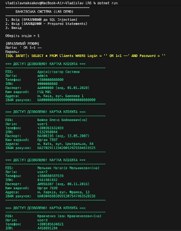
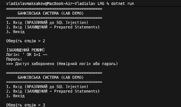

# Application_and_data-security-LR6
# SQL Injection Demo: Атака та Захист

Цей проект є лабораторною роботою, що демонструє принцип дії атаки **SQL Injection (SQLi)** та метод захисту від неї за допомогою **параметризованих запитів (Prepared Statements)**.

Програма реалізована як консольний додаток на мові C# з використанням бази даних SQLite.

## 📋 Опис функціоналу

Додаток імітує банківську систему з базою даних клієнтів (PII дані: паспорт, ІПН, IBAN).
Реалізовано два режими авторизації:
1.  **Вразливий режим:** Використовує конкатенацію рядків. Дозволяє обійти перевірку пароля та отримати доступ до даних усіх користувачів.
2.  **Захищений режим:** Використовує `SqliteCommand.Parameters`. Унеможливлює впровадження SQL-коду.

## 🛠 Технологічний стек
* **Мова:** C# (.NET 8.0)
* **СУБД:** SQLite
* **IDE:** VS Code (macOS/Windows/Linux)
* **Бібліотека:** `Microsoft.Data.Sqlite`

---

## 🚀 Інструкція із запуску
### 1. Попередні вимоги
Переконайтеся, що встановлено .NET SDK. Перевірка версії:
dotnet --version

### 2. Встановлення залежностей
Якщо проект відкрито вперше, відновіть пакети NuGet:
dotnet restore

---

### Частина 2: База даних та Запуск
### 3. База даних
Файл бази даних `users_db.sqlite` має знаходитися у кореневій папці проекту (поруч із файлом `Program.cs` або файлом проекту `.csproj`).

### 4. Запуск
Виконайте команду в терміналі:
dotnet run

---

### Частина 3: Сценарії тестування та Структура
## 🧪 Сценарії тестування (Результати)

### Сценарій 1: Успішна атака (SQL Injection)
**Крок 1.** У меню оберіть опцію **`1`** (Вразливий режим).
**Крок 2.** Введіть наступні дані:
* **Логін:** `' OR 1=1 --`
* **Пароль:** (залиште пустим або введіть будь-що)

**Результат:**
Система сприймає `OR 1=1` як істину для всіх рядків і коментує перевірку пароля (`--`). Відбувається витік даних усієї бази (Mass Assignment).

---

### Сценарій 2: Робота захисту (Prepared Statements)
**Крок 1.** У меню оберіть опцію **`2`** (Захищений режим).
**Крок 2.** Спробуйте ту саму атаку:
* **Логін:** `' OR 1=1 --`
* **Пароль:** `123`

**Результат:**
Система шукає користувача, у якого логін буквально дорівнює рядку `' OR 1=1 --`. Такого користувача не існує, тому доступ заборонено. Ін'єкція не спрацювала.

## 📂 Структура проекту

* `Program.cs` — Головний файл із логікою додатка.
* `users_db.sqlite` — Файл бази даних (зберігає таблицю `Clients`).
* `SQLi_Lab.csproj` — Файл конфігурації проекту .NET.